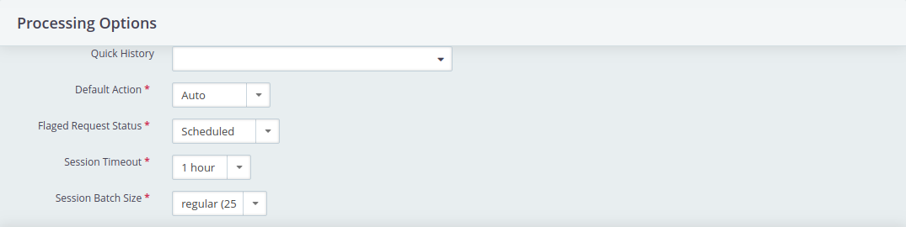
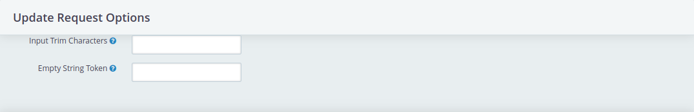
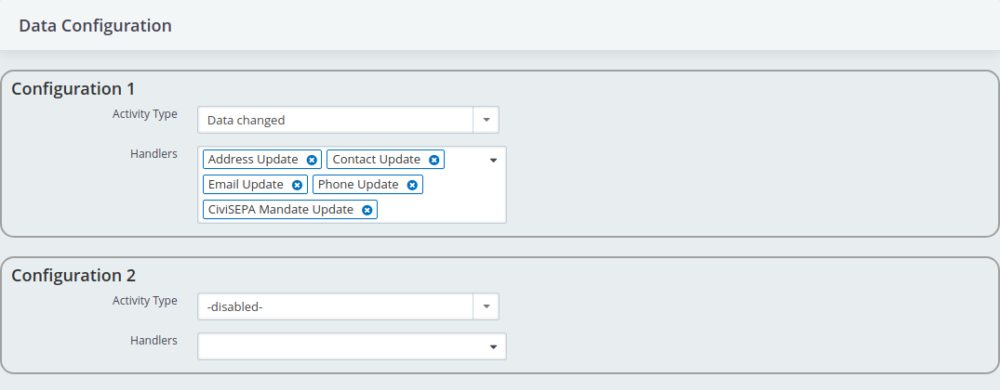

# Configuration

Once installed, the I3Val extension provides a configuration interface
accessible at *Administration* → *System Settings* → *Configure I3Val* with
the following configuration options:

## Processing Options

This section defines options for processing change requests using the I3Val
Desktop.

### Quick History

When processing data change requests for a contact, activities of the type(s)
selected here will be shown in a drop-down area in the I3Val Desktop for
reference of which changes have been either scheduled, processed or marked
problematic for the contact.

Reviewing closed activities may be useful for deciding what to do with a change
request. Also, seeing multiple scheduled change requests for the same contact
may indicate interferences with the current change request. In this case, an
information message will appear, informing you about other scheduled change
requests for the same contact, offering you to process all of them in a new
batch.

### Default Action

This option defines the default action to select for a change request. Selecting
"Automatic" will try to choose the most appropriate action for each entry. The
default action will not be applied automatically, it will just be pre-selected
within the I3Val Desktop processing handler panels, still giving you the
possibility to change it before applying the change request.

### Flagged Request Status

This option defines the activity status to set the change request activity to
when flagging as problematic.

### Session Timeout

This option defines the time until a composed batch of change requests times out
and the contained change requests can be used within new batches.

### Session Batch Size

This option defines how many change requests will be put together in a batch.

## Update Request Options

This section defines options for data stored with change requests when
processing them using the I3Val Desktop. Those are generally common validators
for providing more sanity of input data automatically.

### Input Trim Characters

Characters within this option will be trimmed from the input data, if present in
front or at the end of the input values. This is usually be set to space
characters, that may be present when data is coming from public forms, but may
be set to e.g. separators or quotation marks being used in external data
sources.

### Empty String Token

If there are input values that should be ignored, this option is to specify such
values. E.g. if empty data is submitted as "None" or "NULL" and those values are
being set here, the input values will be seen as non-existent and be ignored.

## Data Configuration

Within this section, an arbitrary number of configuration sets can be defined.
Those sets define which data changes should be processed. Which configuration
set is being used is defined by the selected activity type.

!!! example
    If you want to only process changes in e-mail addresses for a certain data
    source (e.g. a newsletter subscription form), change request activities
    should be created with a specific activity type, which should then be
    configured to only use the *Email Update* handler in the I3Val configuration
    set. All other changes will not be processed.

### Activity Type

The activity type is the primary parameter for deciding which I3Val
configuration to use for processing change requests.

You should select an activity type that is to be solely used for registering
change requests, since all activities of that type will be taken into account
when processing the change requests using the I3Val Desktop, and activities of
that type without any change request information on it are prone to cause errors
during that process. Therefore, you should create a separate activity type for
use of recording change requests through I3Val.

### Handlers

You may define which data handlers should be used to process change requests per
activity type.
