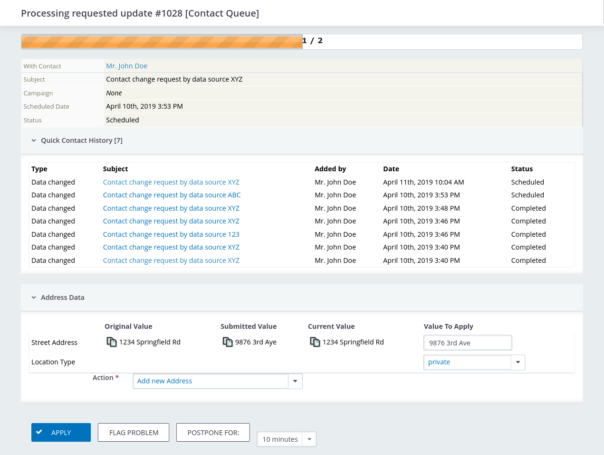

# Processing change requests

In the navigation menu, go to *Contacts* → *Process Pending Update Requests* to
load the I3Val Desktop.

I3Val will, according to the batching options set in the I3Val configuration,
create a batch of change requests for the current user and show the first item.

How many items are left to be processed in the system is being shown with a progress bar. 
Please note that this number is not re-calculated after every request, so 
it might jump a bit, when new requests are coming in while you work, or when 
somebody else is processing change requests at the same time.

## Change request information

Below, you will see the following information:

*   *With Contact* - the contact the change was requested for
*   *Subject* - the subject of the change request activity
*   *Campaign* - (optional) the campaign associated to the change request
*   *Scheduled Date* - the date the changes were requested
*   *Status* - the status of the change request activity
*   *Note* - in case a note (``i3val_note``) was passed when creating the change request

## Quick Contact History

If set within the I3Val configuration, the *Quick History* shows a list of
change request activities recorded for he currently reviewed contact for
reference.

## Data Processing Handlers

Each handler defines its very own user interface of the to-be-updated values and 
offers different options for user interaction or confirmation. 

Most of the standard data processing handlers will list the changes they can
process. For each field requested to be changed, the following values will be
shown:

*   *Original Value* - The value the field had when the change was requested
*   *Submitted Value* - The value the field was requested to be set to
*   *Current Value* - The current value of the field (may differ from the
    original value)

The next column provides a widget for you to choose a value to set when
confirming the change request. This may be either of the three aforementioned
values or the one you set manually (e.g. to correct spelling errors). You can
also use the *Copy* icons within each value column to copy the respective value
into the *Value To Apply* field, which saves you typing and avoids spelling
errors.

Depending on the processor type, further options may be required to be set, e.g.
for contact details (e-mail addresses, phone numbers, addresses, etc.) which
location type to use and whether to create a new detail entry or overwrite the
existing one.

## Actions

### Apply changes

By hitting *Apply*, the change request is being confirmed and the changes will
be written to the contact and/or its details.

### Mark problematic

When being unsure about what to do with the change request, it can be flagged as
"problematic", which makes it not appear again in batches and be marked for
manual investigation by setting the activity status to the one set within the
I3Val configuration.

Don't forget to set up a process to later pick up on these flagged requests, 
as they will not re-appear in the queue by themselves.

### Postpone

If you want to review the change request again later, hitting *Postpone for*
will put the entry on hold for the time span selected within the drop-down field
next to the button. The change request will be available for being put into a
new batch when that time span is expired.
